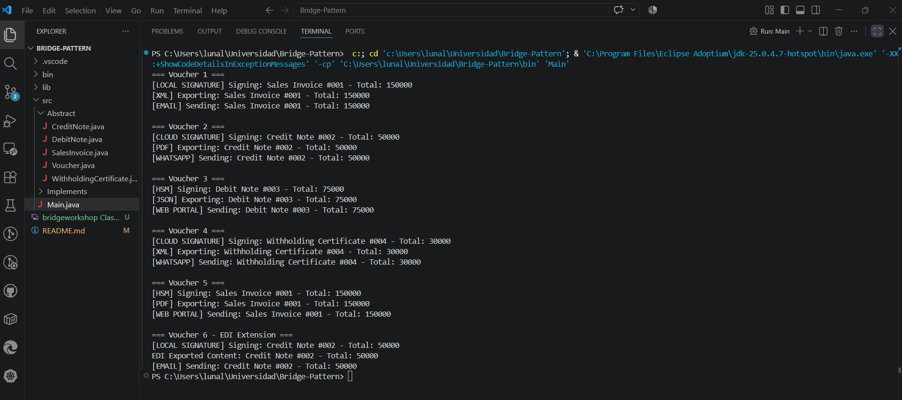

# Electronic Voucher System

> Introduction to Bridge Pattern

- Sharon Stefany Castilla Araque ~ 20251020089
- Luna A. Sandoval Rodríguez ~ 20241020053

## Description

The context of this project is about a small electronic billing system for a retail chain. The system supports different types of vouchers, each with its own content construction logic.

The main goal is to allow vouchers to work with different export formats, sending channels, and electronic signature providers without creating a subclass for every possible combination.

- **Note:** The export formats, sending channels, and signature providers are represented through interfaces and can vary independently from the voucher types.

## UML Diagram

## Project Structure

- Package: `Exporters`

1. *interface* `FormatExporter`
2. class `XMLExporter`
3. class `PDFExporter`
4. class `JSONExporter`
5. class `EDIExporter`

- Package: `SendingChannels`

1. *interface* `SendingChannel`
2. class `EmailChannel`
3. class `WhatsAppChannel`
4. class `WebPortalChannel`

- Package: `SignatureProviders`

1. *interface* `SignatureProvider`
2. class `LocalSignature`
3. class `CloudSignature`
4. class `HSMProvider`

- Package: `Vouchers`

1. abstract class `Voucher`
2. class `SalesInvoice`
3. class `CreditNote`
4. class `DebitNote`
5. class `WithholdingCertificate`

- `Main`

## How to Run

1. Clone or download the repository.
2. Open the project in a Java-compatible IDE such as VS Code, IntelliJ IDEA, or Eclipse.
3. Make sure Java is correctly installed and configured.
4. Run the `Main` class.
5. Check the console output to observe the different voucher combinations.
6. Verify that different vouchers can work with different export formats, sending channels, and signature providers.
7. Check the EDI extension to verify that a new export format can be added without modifying the `Voucher` hierarchy.

## Console Output

## Analysis Response

*The architecture department requests the addition of a new export format, EDI, without modifying or recompiling any classes in the Comprobante hierarchy. Based on the diagram you created, answer the following in 1-2 lines: What new class should you create, what type should it inherit from or implement, and why does this operation not require modifying Comprobante or any of its four subclasses?*

**Answer:** The new class that needs to be created is `EDIExporter`, which must implement the `FormatExporter` interface. This does not require modifying Voucher or its subclasses because they depend on the FormatExporter interface, not a specific implementation, allowing new formats to be added independently.

*Last Modification: 14/08/2026*